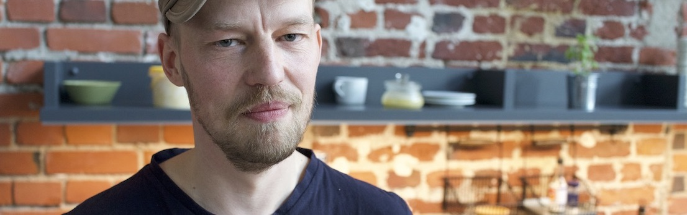

# Kristjan Jansen

<big>Hi, I am a UX/UI designer, developer and educator. I used to work for **Skype** and **Bolt**. Here is my [web resume](#kristjan-jansen-cv) and [PDF resume](kristjan_jansen_cv.pdf). See also my [Github](http://github.com/kristjanjansen), [Twitter](http://twitter.com/kristjanjansen) and [Linkedin](http://ee.linkedin.com/pub/kristjan-jansen/15/b06/778) pages.</big>

 

 

<big><b style="color: var(--orange)">I am available for hiring.</b> Contact me on [kristjan.jansen@gmail.com](mailto:kristjan.jansen@gmail.com) or [+372 5016439](tel:+3725016439).

### Senior frontend developer in Garden

In Garden, a **Kubernetes** developer tooling company in Berlin, my role was to design and build out interfaces in **React**, including enterprise product offering, public website, a **design system written in Typescript** and also experimental UIs like **live dashboard** and **CLI client**.

<small>2020</small>

### Founder and lead developer in Fachwerk and Visualia

I am a founder, lead developer, and designer of an **open-source frontend frameworks** [Fachwerk](https://github.com/designstem/fachwerk) and it's successor [Visualia](https://github.com/visualia/visualia), build on top of **VueJS** that helps educators to create interactive learning experiences without programming knowledge.

The frameworks provide a simple authoring environment where the educators can create rich content, including 2D and 3D graphics, realtime communications, audio and MIDI streams, beautiful math, and more.

<small>2018-2020 &ensp;https://github.com/designstem/fachwerk &ensp;https://github.com/visualia/visualia</small>

### UX developer in Bolt data science team

My role was to help the Bolt data science team to modernize their geovisualization stack, allowing them to work with larger datasets in the browser more efficiently.

The solution provided was a series of **interactive visualizations for high volume transportation data** based on **React**, **kepler.gl**, **deck.gl** and data backend based on **Apache Arrow**. The design deployment process was handled by **Vercel** platform.

Bolt data science team picked up the tooling and now develop their solutions based on the proposed prototypes.

<small>2018 &ensp;https://bolt.eu/</small>

### UX developer in Sixfold frontend team

My role was to work with the design lead to prototype the logistics application in **React** and to provide **UI&nbsp;components** and **design tokens** for the frontend team.

The work included creating **parametric user interface** in React to enabling all team members to participate in the design process.

<small>2018 &ensp;https://sixfold.com/</small>

### Experimental UI designer in Proekspert R&D team

In Proekspert, I worked on the next-generation user experience, prototyping the UI solutions and testing technologies for upcoming products.

Some of the work included **realtime anomaly detection dashboard**, **interactive visualizations** for factory floors, **VR big data experiments**, **commandline UX design** and **generative brand visuals generator**.

The leading technologies used were **VueJS** and **d3** in the frontend and **NodeJS** and **Socket.io** in the backend.

<small>2016-2017 &ensp;https://proekspert.ee/</small>

### UX lead Jumia Porto Tech Center, Portugal

My role in Jumia was **building a design team for emerging markets** and bringing the UX to the decision table.

In addition to hiring, design consultancy, and managing user research, I also prototyped several solutions to build up **design systems** and optimize the company's products **frontend performance** for extreme bandwidth limitations sub-Saharan internet.

<small>2014-2015 &ensp;https://www.linkedin.com/company/porto-tech-center</small>

### Senior interaction designer and release design lead in Skype

Hired as a first interaction designer in the company, I designed several key features of the product, conducting usability studies and **prototyping next-generation Skype client** that later became the current Skype user interface.

<small>2005-2008 &ensp;http://skype.com</small>

### Founder and CTO for Trip.ee

<small></small>

Trip.ee is Estonian oldest and most popular travel site. I have been building and designing the site for over two decades.

Originally based on **Drupal**, the latest iteration of the site is built on **Laravel**, **VueJS** and **custom rendering engine** [Cusco](https://github.com/kristjanjansen/cusco) implemented in PHP.

<small>1998-2018 &ensp;https://trip.ee &ensp;https://github.com/tripikad/trip2</small>

### Other projects

I have also worked on improving the user experience on many other projects, including **universities** (Tartu University), **startups** (Daily Perfect, Station, VTV), **telecommunications** (EMT), **ecommerce sites** (Hewlett-Packard, Hansapost, Klick), **nonprofit organizations** (Keskkonnateated, The Happyness Bank, Municipality Tools, Praxis, Open Data Estonia) and **creative coding / performing arts** (MIMProject, eˉlektron)

 

    
